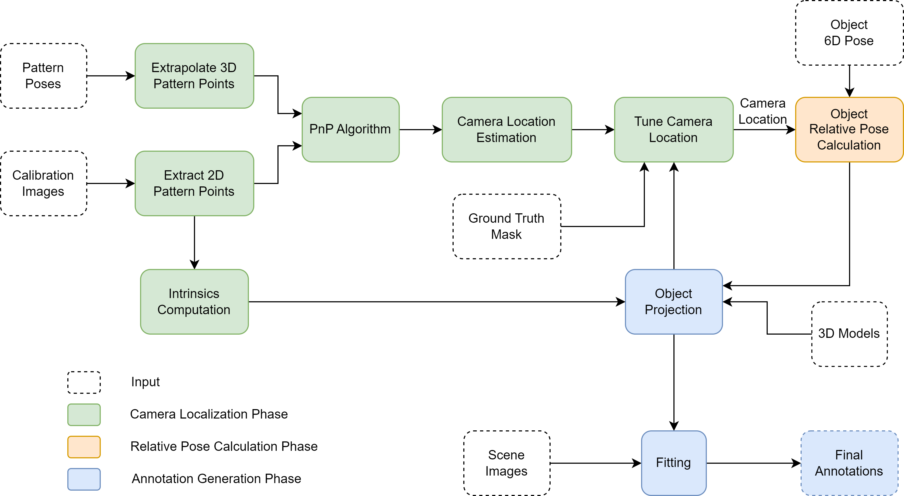

# BOP Toolkit

A Python toolkit of the BOP benchmark for 6D object pose estimation
(http://bop.felk.cvut.cz).

- **bop_toolkit_lib** - The core Python library for i/o operations, calculation
  of pose errors, Python based rendering etc.
- **docs** - Documentation and conventions.
- **scripts** - Scripts for evaluation, rendering of training images,
  visualization of 6D object poses etc.

## Annotation Pipeline for Multi-view 6D Object Pose Estimation
We present an annotation pipeline to automatically annotate monocular RGB images. Our approach localizes cameras in space, unifies their location with a motion capture system, and uses a set of linear mappings to project 3D models of objects of interest at their ground truth 6D pose locations. 


<p style="text-align: center;">Overview of our annotation pipeline</p>


## Installation

### Python Dependencies

To install the required python libraries, run:
```
pip install -r requirements.txt -e .
```

In the case of problems, try to first run: ```pip install --upgrade pip setuptools```

### Vispy Renderer (default)

The Python based headless renderer with egl backend is implemented using [Vispy](https://github.com/vispy/vispy).
Vispy is installed using the pip command above.
Note that the [nvidia opengl driver](https://developer.nvidia.com/opengl-driver) might be required in case of any errors.

### Python Renderer (deprecated)

Another Python based renderer is implemented using
[Glumpy](https://glumpy.github.io/) which depends on
[freetype](https://www.freetype.org/) and [GLFW](https://www.glfw.org/).
This implementation is similar to the vispy renderer since glumpy and vispy have similar apis,
but this renderer does not support headless rendering.
Glumpy is installed using the pip command above. On Linux, freetype and GLFW can
be installed by:

```
apt-get install freetype
apt-get install libglfw3
```

To install freetype and GLFW on Windows, follow [these instructions](https://glumpy.readthedocs.io/en/latest/installation.html#step-by-step-install-for-x64-bit-windows-7-8-and-10).

GLFW serves as a backend of Glumpy. [Another backend](https://glumpy.readthedocs.io/en/latest/api/app-backends.html)
can be used but were not tested with our code.

### C++ Renderer

For fast CPU-based rendering on a headless server, we recommend installing [bop_renderer](https://github.com/thodan/bop_renderer),
an off-screen C++ renderer with Python bindings.

## Usage

### 1. Get the BOP datasets

Download the BOP datasets and make sure they are in the [expected folder structure](https://bop.felk.cvut.cz/datasets/).

### 2. Run your method

Estimate poses and save them in one .csv file per dataset ([format description](https://bop.felk.cvut.cz/challenges/bop-challenge-2020/#howtoparticipate)).

### 3. Configure the BOP Toolkit

In [bop_toolkit_lib/config.py](https://github.com/thodan/bop_toolkit/blob/master/bop_toolkit_lib/config.py), set paths to the BOP datasets, to a folder with results to be evaluated, and to a folder for the evaluation output. The other parameters are necessary only if you want to visualize results or run the C++ Renderer.

### 4. Evaluate the pose estimates
```
python scripts/eval_bop19.py --renderer_type=vispy --result_filenames=NAME_OF_CSV_WITH_RESULTS
```
`--renderer_type`: "vispy", "python", or "cpp" (We recommend using "vispy" since it is easy to install and works headlessly. For "cpp", you need to install the C++ Renderer [bop_renderer](https://github.com/thodan/bop_renderer).).

`--result_filenames`: Comma-separated filenames with pose estimates in .csv ([examples](http://ptak.felk.cvut.cz/6DB/public/bop_sample_results)).

### 5. Evaluate the detections / instance segmentations
```
python scripts/eval_bop_coco.py --result_filenames=NAME_OF_JSON_WITH_COCO_RESULTS --ann_type='bbox'
```
--result_filenames: Comma-separated filenames with per-dataset coco results (place them under your `results_path` defined in your [config.py](bop_toolkit_lib/config.py)).  
--ann_type: 'bbox' to evaluate amodal bounding boxes. 'segm' to evaluate segmentation masks.

## Convert BOP to COCO format

```
python scripts/calc_gt_coco.py
```

Set the dataset and split parameters in the top section of the script.
